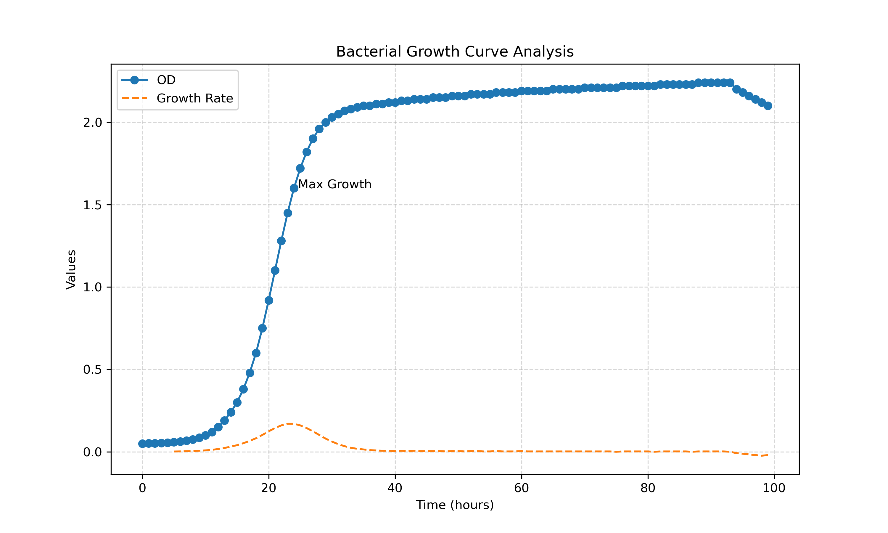

# Bacterial Growth Curve Analysis

This project analyzes bacterial growth using Optical Density (OD600) data and calculates growth rate to identify different growth phases.
It is a Practice project, Real data is not used in it.

## Key Concepts
- OD (Optical Density) as a proxy for bacterial biomass
- Growth rate calculated using difference in OD
- Smoothing applied using rolling mean

## Results
- Maximum growth occurs at ~24 hours
- Clear Lag, Log, and Stationary phases observed
- Slight decline suggests beginning of death phase

## Limitations
- OD cannot distinguish between live and dead cells
- Measurements may become unreliable at high cell density

## Output

